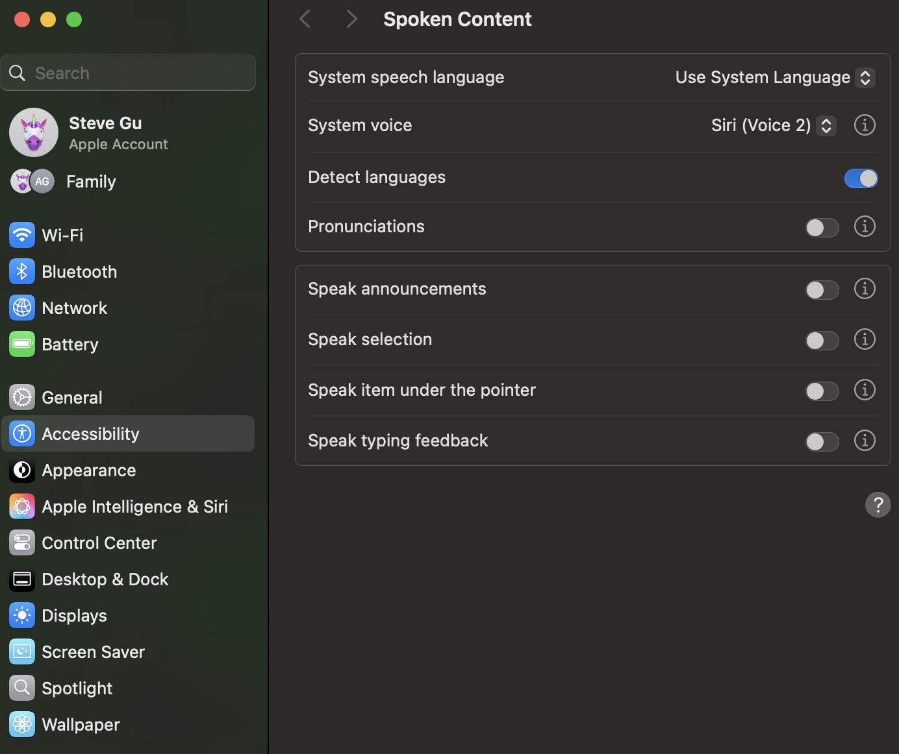
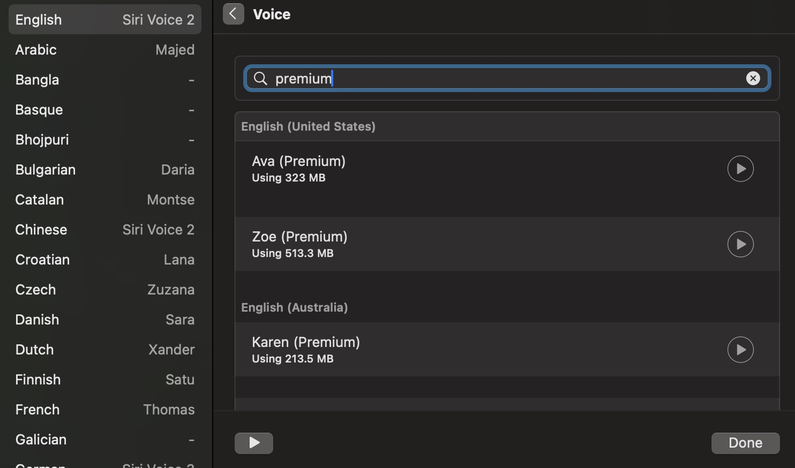
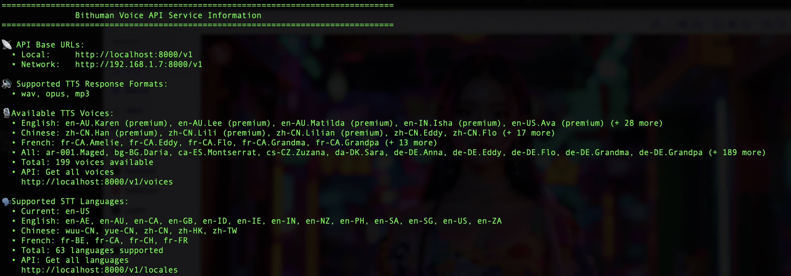
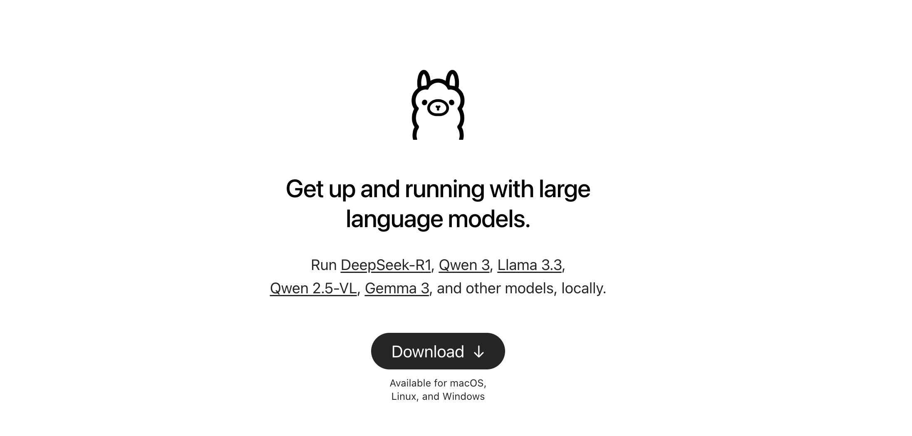
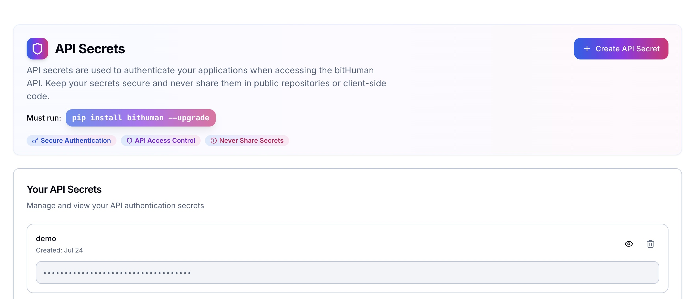
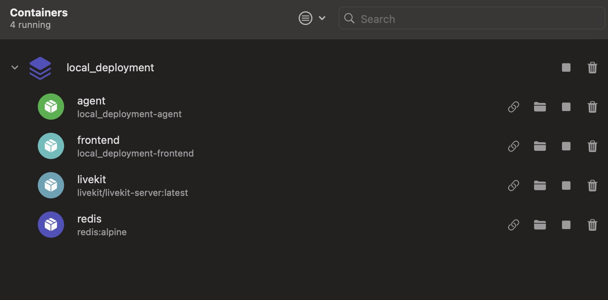

# bitHuman Visual Agent App - 100% Local on MacOS

A completely local deployment of bitHuman's AI visual agent running on Apple M2+/M3/M4 devices with real-time conversation capabilities. Everything runs locally: Apple Speech Recognition (STT), Ollama LLM, Apple Voices/Siri (TTS), LiveKit, and bitHuman SDK.

## What You Need

**For M2+/M3/M4 MacOS devices:**
- Docker and Docker Compose (**We strongly recommend [OrbStack](https://orbstack.dev/) for better performance and easier management**)
- `BITHUMAN_API_SECRET` (requires periodic internet access) or offline token for 100% internet-free operation (contact bitHuman team)
- `.imx` model files (place in `./models/` directory)
- Python 3.8+ for bitHuman's Apple plugin
- [Ollama](https://ollama.com/) for local LLM

## Local Setup Steps

### 1. Install bitHuman's Apple Plugin

Install bitHuman's Apple STT (Speech Recognition) and TTS (Siri/Apple voices) plugin for LiveKit:

```bash
pip install https://github.com/bithuman-prod/public-sdk-examples/releases/download/v0.1/bithuman_voice-1.3.2-py3-none-any.whl
```

### 2. Configure Apple Voices

Configure Apple voices by going to System Settings. We recommend either **Siri voices** or **Apple's premium voices**. You need to download them first.

**Select and download premium voices:**





### 3. Start bitHuman's Apple TTS/STT Services

Start the bitHuman Apple voice services:

```bash
bithuman-voice serve --port 8000
```

**bitHuman Voice Service Running:**



### 4. Install and Run Ollama (Local LLM)

Follow the instructions at [https://ollama.com/](https://ollama.com/) to install Ollama, then download a lightweight LLM model:

```bash
ollama run llama3.2:1b
```

For slightly better performance (if you have sufficient RAM):
```bash
ollama run llama3.2:3b
```

**Download Ollama Model:**



### 5. Configure Environment

**Get your bitHuman API Secret:**



Create a `.env` file:

```bash
BITHUMAN_API_SECRET=your_api_secret_here
# Note: OPENAI_API_KEY not needed for local setup
```

### 6. Add Models

Place your `.imx` files in the `models/` directory:

```bash
# Example - models/ directory should contain:
models/
└── YourModel.imx
```

**Download .imx models from bitHuman:**


### 7. Start Services

```bash
docker compose up
```

Wait for all services to start (first run takes a few minutes).

**Docker Services Running:**



### 8. Access the App

Open http://localhost:4202 in your browser.

**App Interface:**


## That's It!

Now you have a **100% local AI agent** running on your Mac! The system includes:

**Local Services:**
- **Apple Speech Recognition**: Local STT via bitHuman's Apple plugin
- **Apple Voices/Siri**: Local TTS via bitHuman's Apple plugin  
- **Ollama LLM**: Local language model (Llama 3.2:1b or 3b)
- **LiveKit**: Local WebRTC communication server
- **Agent**: AI conversation handler with local components
- **Frontend**: Web interface
- **Redis**: Message broker

**100% Offline Mode:**
- **API Secret**: Requires periodic internet access for authentication and metering
- **Offline Token**: For complete internet-free operation, contact the bitHuman team directly for a dedicated offline token. This is available for Enterprise customers and developers who need fully offline access.

## Development

**Edit agent code:**
```bash
vim agent.py
docker compose restart agent
```

**View logs:**
```bash
docker compose logs -f agent
```

**Stop everything:**
```bash
docker compose down
```

## Troubleshooting

**Services won't start?**
- Check `.env` file exists with valid `BITHUMAN_API_SECRET`
- Ensure models/ directory contains `.imx` files
- Verify bitHuman voice service is running on port 8000: `bithuman-voice serve --port 8000`
- Check Ollama is running and model is downloaded: `ollama list`
- Run `docker compose logs [service]` to see errors

**Port conflicts?**
- Frontend uses port 4202
- LiveKit uses ports 17880-17881 and UDP 50700-50720
- bitHuman voice service uses port 8000
- Ollama typically uses port 11434

**Voice/Speech issues?**
- Ensure Apple voices are downloaded in System Settings
- Check bitHuman voice service is running: `ps aux | grep bithuman-voice`
- Verify microphone permissions are granted to your terminal/browser

**Ollama model issues?**
- Check if model is downloaded: `ollama list`
- Try downloading again: `ollama pull llama3.2:1b`
- Ensure sufficient RAM for the model size

**Clean restart:**
```bash
# Stop bitHuman voice service (Ctrl+C if running in terminal)
# Stop Ollama if needed
docker compose down -v
docker compose up --build
# Restart bitHuman voice service: bithuman-voice serve --port 8000
```

